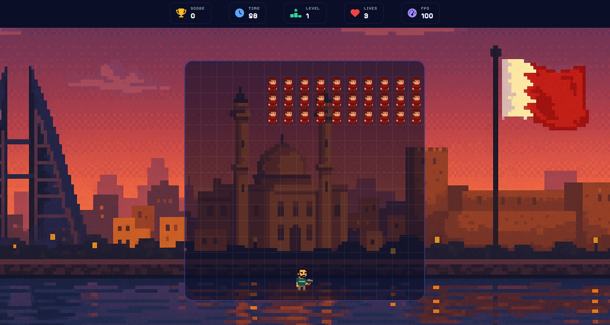

# Rebooter01 — Invaders

A browser-based Space Invaders game with 5 levels, a story mode, a final boss, and a live leaderboard powered by a Go backend.




## Features

- **5 Levels** — increasing difficulty with faster invaders each level
- **Classic & Story Mode** — play with or without narrative cutscenes
- **Final Boss** — survive to Level 5 and face the boss
- **Leaderboard** — scores are persisted via a Go server and ranked globally
- **FPS counter**, **lives system**, and **60-second timer** per round

## Controls

| Key                | Action         |
| ------------------ | -------------- |
| `←` `→` Arrow Keys | Move shooter   |
| `Space`            | Shoot          |
| `P` or `Esc`       | Pause / Resume |
| `R`                | Restart        |

## Getting Started

```bash
go run main.go
```

Then open [http://localhost:8080](http://localhost:8080) in your browser.

## Tech Stack

- **Frontend** — Vanilla JS (ES Modules), HTML5, CSS3
- **Backend** — Go (`net/http`) for scoreboard API
- **Storage** — `scoreboard.json` (flat-file persistence)

---

> Made by Reboot01 Talent
